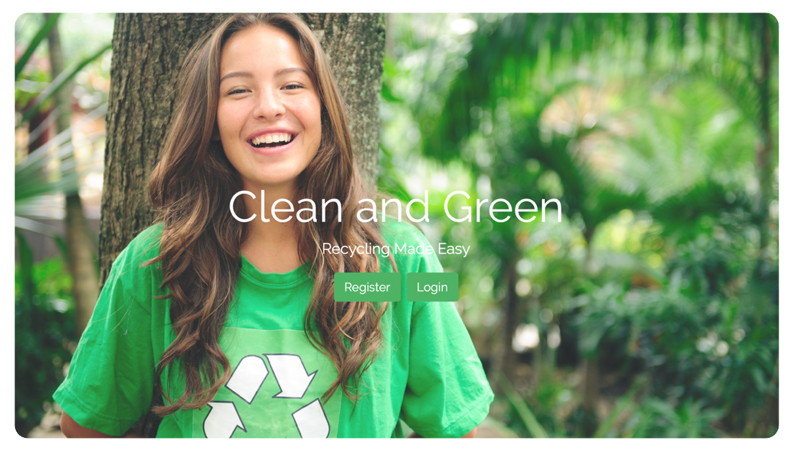

# Clean-and-Green
Project "Clean &amp; Green" for CSC436/446
Team Members: Sam Tursunov, Naz Islam, Vasu

The project is to develop a website that will allow users to recycle their trash with maximum efficiency. The website will allow users to register profiles and give them the ability to ping their location whenever they have a substantial amount of recyclables. It will also allow users to respond to the pinged location, indicating that they will be picking up the recyclables.

## User Types:
#### **Client**

Send a pickup request by specifying:
1. Address
2. Things to be picked up
3. How many bags needed

#### **Driver**
Process a pickup request

## Design and Architecture Functionalities:
1. User registration
2. User authentication and sign in
3. User profile
4. Logout users
5. Submit a pickup request
6. Google Map API
7. Seperate views for Clients and Drivers
8. Users will only be able to send a pickup request if thye don't have any request pending
9. Remove a processed request from map
10. Showing markers on the location on map
11. Process a pickup requst

